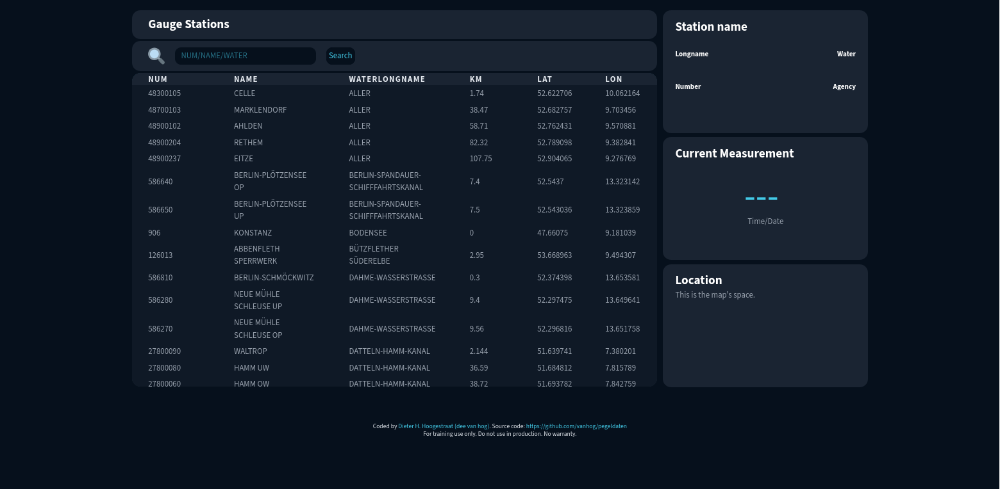

# Gauge Stations Dashboard (Pegeldaten)

**For training use only. Do not use in production. No warranty.**

This repository is a frontend training project created as part of the OpenCampus Web Development Program.

## Table of contents

- [Overview](#overview)
  - [What the app does](#what-the-app-does)
  - [Screenshot](#screenshot)
  - [Links](#links)
- [Screenshot](#screenshot)
- [Features](#features)
- [Getting started](#getting-started)
- [Built with](#built-with)
- [Architecture & notes](#architecture--notes)
- [Useful resources](#useful-resources)
- [Author](#author)

## Overview

This is a single-page frontend application that lists hydrological gauge stations (Pegel) and provides quick access to station metadata, current measurements, a small timeseries chart and an embedded map view.

### What the app does

- Fetches station and timeseries data from the Pegelonline REST API
- Renders an interactive, sortable table with a sticky header
- Supports searching/filtering by station number, short name, and river name
- Opens detail drawers on row double-click to show metadata and current measurements
- Displays a Chart.js timeseries plot for recent measurements
- Shows a Leaflet map in the Location drawer (map is initialized and updated)

### Screenshot



### Links

- Solution URL: https://github.com/vanhog/pegeldaten
- Live Site URL: https://vanhogs-pegeldaten.netlify.app/

## Features

- Interactive, sortable station table (click column headers)
- Sticky table header while scrolling
- Double-click to open station details
- Current measurement display and timestamp
- Timeseries chart (Chart.js) for selected station
- Leaflet map showing station coordinates

## Getting started

Prerequisites: Node.js and npm installed.

Install and run locally:

```bash
npm install
npm run dev      # start Vite dev server
npm run build    # runs `tsc && vite build` to build production bundle
npm run preview  # preview production build
```

Open the app at the URL printed by the Vite dev server (usually http://localhost:5173).

## Built with

- TypeScript
- Vite
- Tailwind CSS (with @tailwindcss/vite)
- Chart.js
- Leaflet (map)
- @js-temporal/polyfill (date/time handling)

## Architecture & notes

- Frontend-only SPA. Data is fetched directly from the Pegelonline REST API.
- UI is modular: table renderer, two detail drawers (metadata + current measurement), chart, and map module.
- The project uses strict TypeScript settings (see `tsconfig.json`). The `build` script runs `tsc` before `vite build`.
- `package.json` contains `pg` and `@types/pg` — these are currently present but no backend is included; they indicate potential future backend/PostGIS work.

## Useful resources

- WSV REST API: https://www.pegelonline.wsv.de/webservice/guideRestapi

## Author

- Website: https://www.hoogestraat.com
- Frontend Mentor: https://www.frontendmentor.io/profile/vanhog
- GitHub: https://github.com/vanhog
