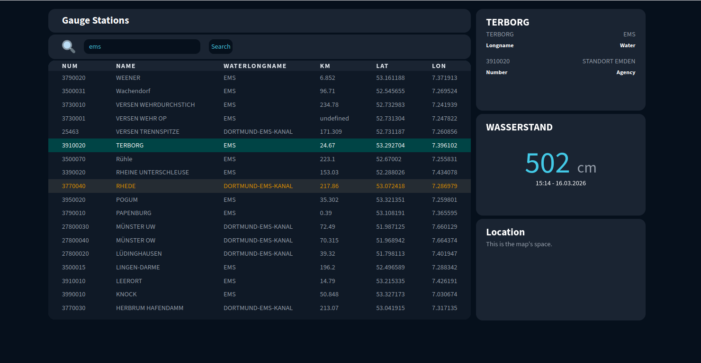

# Gauge Stations Dashboard (Pegeldaten)

This is a free-style training project created as part of the OpenCampus Web Development Program 2025.

## Table of contents

- [Overview](#overview)
  - [The challenge](#the-challenge)
  - [Screenshot](#screenshot)
  - [Links](#links)
- [My process](#my-process)
  - [Built with](#built-with)
  - [Architecture](#architecture)
  - [What I learned](#what-i-learned)
  - [Continued development](#continued-development)
  - [Useful resources](#useful-resources)
- [Author](#author)

## Overview

### The challenge

The application should be able to:

- Fetch station data from the Pegelonline REST API
- Display the data in an interactive table:
  - Sort ascending/descending by clicking on column headers
  - Scroll through the list of stations
  - Keep the table header sticky while scrolling
- Open a detail view (drawer) on double-clicking a table row
- Display:
  - General station information in one drawer
  - Current measurements in a second drawer
- Reserve a third drawer for future map integration
- Provide search functionality across:
  - short name
  - long name
  - water short name
  - water long name
  - station number

### Screenshot

### Links

- Solution URL: https://github.com/vanhog/pegeldaten  
- Live Site URL: https://vanhogs-pegeldaten.netlify.app/

## My process

### Built with

- Semantic HTML5
- Tailwind CSS
- CSS custom properties
- Flexbox & CSS Grid
- Mobile-first workflow
- TypeScript

### Architecture

- Frontend-only application (no backend yet)
- Data fetched directly from external REST API (Pegelonline)
- State handled in the browser using TypeScript
- Modular rendering approach (table + drawers)

## What I learned

- Fetching and handling data from a REST API
- Implementing a sticky table header
- Dynamically rendering table data with TypeScript
- Transforming and mapping API data structures
- Structuring UI components (table, drawers, state handling)
- Using AI tools to support development (e.g. object mapping)

## Continued development

Next steps:

- Integrate an interactive map to display station locations
- Improve performance for large datasets
- Add filtering and advanced search capabilities
- Enhance accessibility (ARIA roles, keyboard navigation)
- Introduce a backend (Node.js + PostGIS) for persistence and scaling

## Useful resources

- WSV REST API: https://www.pegelonline.wsv.de/webservice/guideRestapi

## Author

- Website: https://www.hoogestraat.com  
- Frontend Mentor: https://www.frontendmentor.io/profile/vanhog  
- GitHub: https://github.com/vanhog

